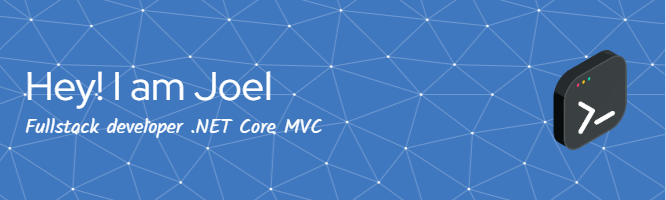
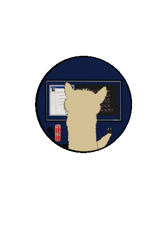

  

   

  
  

###

> #### <strong>Detalles:</strong>
>
> - 💻 Me encanta programar.
> - 📚 Estudio Ingeniería Informática.
> - ⚡ Soy profesor.
>
> 🫨 "En *teoria* todo es *practica*" -**Joel Garbagnate**.

<h3 align="left">🛠 Lenguajes y herramientas:</h3>

###

  <h3 align="left"><strong>Herramientas:</strong></h3>
  
  
  
  <h3 align="left"><strong>Lenguajes:</strong></h3>
  
  
  
  
  
  
  <h3 align="left"><strong>Frameworks:</strong></h3>
  
  
  
  
  
  
  
  <h3 align="left"><strong>Bases de Datos:</strong></h3>
  
  
  
  <h3 align="left"><strong>Control de versiones:</strong></h3>
  
  

###
